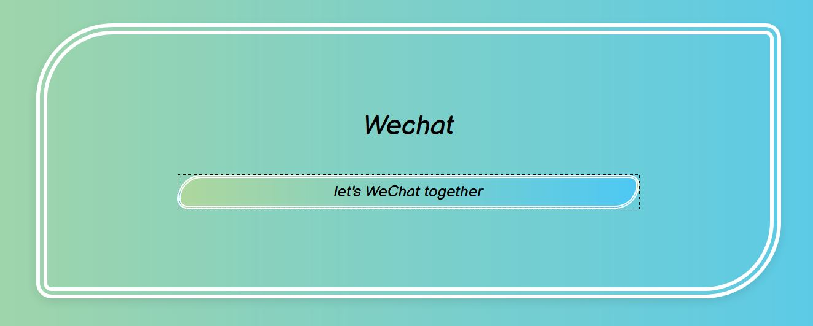

# We Chat
 
This is  an interactive chat application built with Node, Express and Vue (with socket.io)  
[Heroku](https://chat-app-meng.herokuapp.com/)

## Functions
✔️ Allow user input their username  
✔️ Allow users send messages to others 
✔️ Show user typing statement 
✔️ Show chat datetime  
✔️ Show online user(s) => still testing

## Code Examples
* socket.on('connections', (data) => { this.connections = data; }); 
* browser-sync start --proxy 'localhost:5050' --files 'index.html' 'public' 
* sass --watch assets/sass:public/css --style compressed

## Reference
* ([{{typing}}](https://masteringbackend.com/posts/build-a-real-time-chat-app-with-vuejs-socket-io-and-nodejs)) 

## How to set up locally
1. npm install
2. npm install -g browser-sync
3. nodemon app
4. browser-sync start --proxy 'localhost:5050' --files 'index.html' 'public'
5. localhost:3000 /5050

## Technologies
* Visual Studio Code
* Window powershell
* Git Bash

## Prerequisites
* HTML
* CSS
* SASS
* Javascript
* Vue
* MySQL
* Node
* Express

## Designer 
Zhu Meng

## Develper
Zhu Meng

## License
This project is licensed under the MIT[MIT]
([MIT](https://choosealicense.com/licenses/mit/)) license

Copyright (c) 2021 Meng Zhu

Permission is hereby granted, free of charge, to any person obtaining a copy of this software and associated documentation files (the "Software"), to deal in the Software without restriction, including without limitation the rights to use, copy, modify, merge, publish, distribute, sublicense, and/or sell copies of the Software, and to permit persons to whom the Software is furnished to do so, subject to the following conditions:

The above copyright notice and this permission notice shall be included in all copies or substantial portions of the Software.

THE SOFTWARE IS PROVIDED "AS IS", WITHOUT WARRANTY OF ANY KIND, EXPRESS OR IMPLIED, INCLUDING BUT NOT LIMITED TO THE WARRANTIES OF MERCHANTABILITY, FITNESS FOR A PARTICULAR PURPOSE AND NONINFRINGEMENT. IN NO EVENT SHALL THE AUTHORS OR COPYRIGHT HOLDERS BE LIABLE FOR ANY CLAIM, DAMAGES OR OTHER LIABILITY, WHETHER IN AN ACTION OF CONTRACT, TORT OR OTHERWISE, ARISING FROM, OUT OF OR IN CONNECTION WITH THE SOFTWARE OR THE USE OR OTHER DEALINGS IN THE SOFTWARE.

